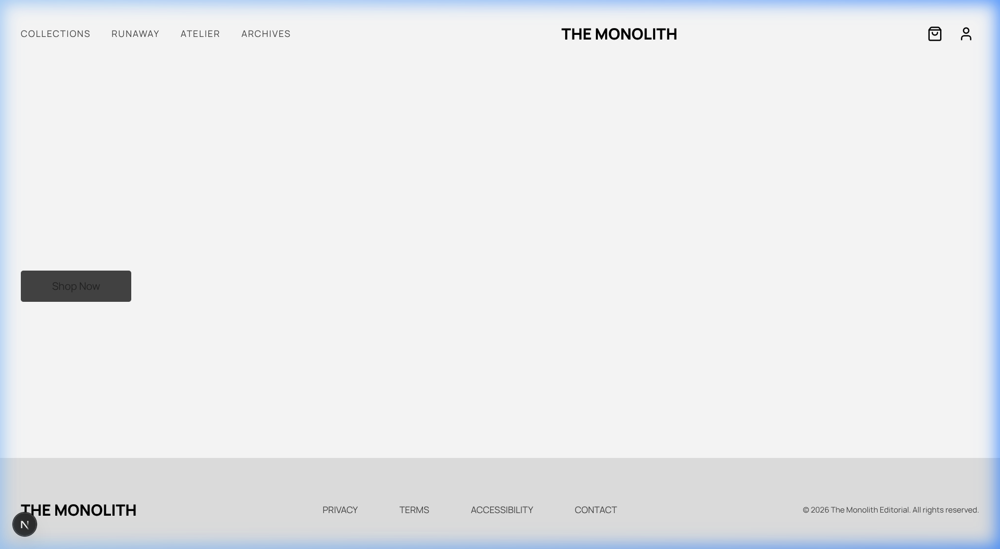
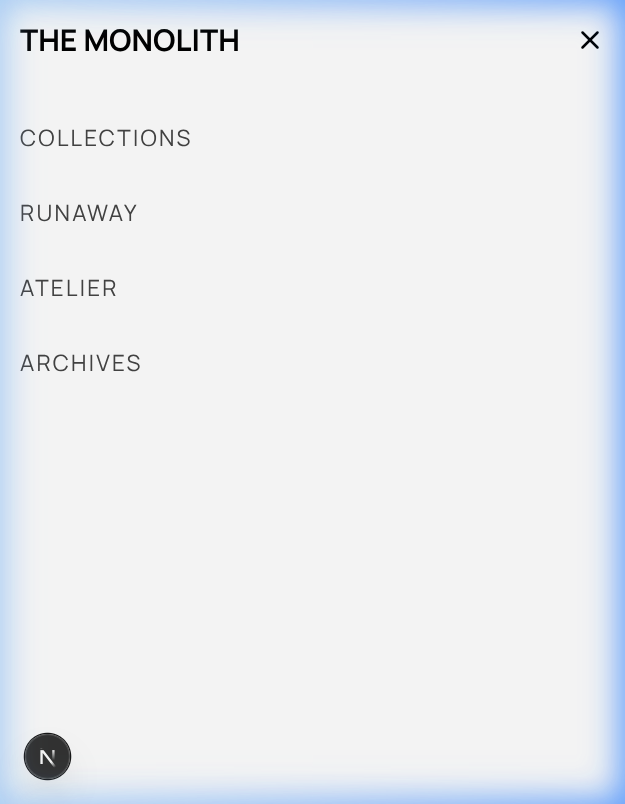

# 🏛️ THE MONOLITH

**THE MONOLITH** is a premium, minimalist e-commerce frontend designed for high-end fashion and architectural retail. Built with Next.js 16 and Tailwind CSS 4, it prioritizes performance, visual excellence, and a seamless mobile experience.

[](https://github.com/4ethyr/The-Monolith-Ecommerce-Frontend/actions/workflows/deploy.yml)
[](https://4ethyr.github.io/The-Monolith-Ecommerce-Frontend/)

## 🖼️ Screenshots

### Desktop Experience


### Mobile-First Design


---

## 🚀 Tech Stack

- **Core:** [Next.js 16](https://nextjs.org/) (App Router)
- **Styling:** [Tailwind CSS 4](https://tailwindcss.com/)
- **Icons:** [Lucide React](https://lucide.dev/)
- **State Management:** React Hooks
- **Deployment:** [GitHub Pages](https://pages.github.com/)
- **Automation:** [GitHub Actions](https://github.com/features/actions)

## ⚙️ CI/CD Workflow

The project features a robust automation pipeline using GitHub Actions:
- **Continuous Integration:** Automatically builds the project on every push to `master`.
- **Automated Deployment:** Deployments to GitHub Pages are handled via the [deployment workflow](.github/workflows/deploy.yml).
- **Optimization:** Static HTML export with unoptimized images for maximum compatibility with static hosting.

## 🛠️ Getting Started

### Prerequisites
- Node.js 20+
- pnpm 9+

### Installation

1. Clone the repository:
```bash
git clone https://github.com/4ethyr/The-Monolith-Ecommerce-Frontend.git
cd The-Monolith-Ecommerce-Frontend
```

2. Install dependencies:
```bash
pnpm install
```

3. Run the development server:
```bash
pnpm dev
```

### Production Build
To generate a static export of the site:
```bash
pnpm build
```
The output will be generated in the `out/` directory.

## 📄 License
This project is for demonstration purposes.

---
Created with ❤️ by [4ethyr](https://github.com/4ethyr)
